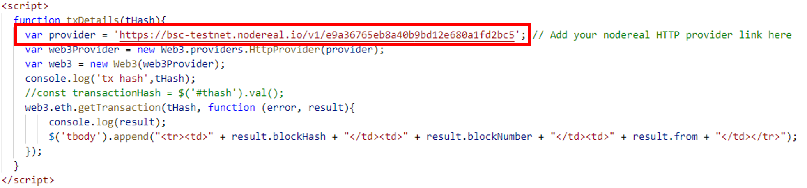
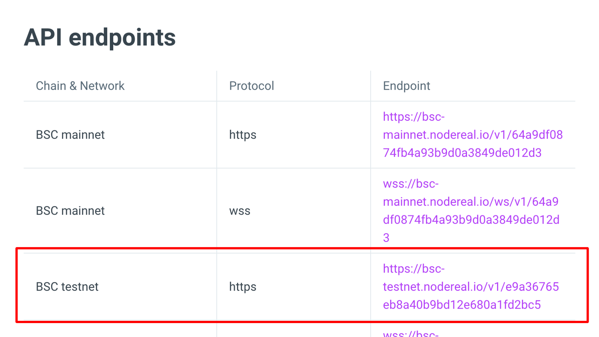
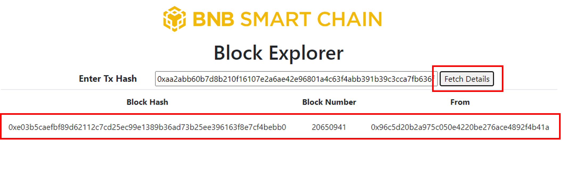

# BSC Hello World Tutorial

## Overview
Designed for anyone wanting to learn development on the BNB Smart Chain, this tutorial provides a step-by-step guide on how to develop a block explorer that uses the Nodereal API to fetch details from the BNB Smart Chain blockchain for the given transaction hash. The technology stack used in this tutorial includes Web3.js, Nodereal MegaNode, and http-server. 

## What You Will Learn
Through this tutorial, you will learn 
- How to use the Web3js library to fetch blockchain data;
- How to use Nodereal’s Meganode API;
- How to deploy static pages onto localhost using http-server

## Target audience
This tutorial aims to provide adequate information to anyone who wants to learn dApp development on BNB Smart Chain.

## Prerequisites
  - node --version
    - v16.13.0
  - npm --version 
    - 8.1.0
  - http-server --version
    - v14.1.1

## Setup

1. **Clone the repository** ```gh repo clone https://github.com/bnb-chain/bnb-chain-tutorial```
2. **Change the current directory** ```cd 02-BSC-Block-Explorer```
3. **Install all the dependencies (node modules)** ```npm install```
   1. **Include Nodereal Meganode API Key** make sure to include the HTTP link for the Nodereal Meganode API in the ```index.html``` as shown in the figure below. For this project we have used the public API key, for a complete is of Nodereal Meganode Public API keys, refer [here](https://docs.nodereal.io/nodereal/meganode/meganode-api-overview/public-api-key). You can also create your own Meganode application as use its API key, for more details refer [here](https://docs.nodereal.io/nodereal/meganode/getting-started). To get more details on how to find your API key, refer [here](https://docs.nodereal.io/nodereal/meganode/getting-started#find-your-api-key).
   


5. **Install htpp-server** ```npm install -g http-server```
6. **Run the application** ```http-server```

## Available Scripts
```sh
  $ http-server
```

## Structure
```
02-BSC-Block-Explorer.
|   index.html
|   list.txt
|   README.md
|   screenshot.png
|   
+---img
|       favicon.ico
|       logo.png
|       screenshot.png
|       
\---js
        web3.min.js
```        

## How it Works
### Checklist
- Make sure you have installed all the dependences using the ```npm install``` command.
- Make sure you have installed http-server using the ```npm install -g http-server``` command.
- Before running the application, make sure that you have included the HTTP link for the Nodereal Meganode API in the ```index.html``` as shown in the figure below.


- For this project we have used the public API key for BSC Testnet as shown in the figure below. For a complete list of Nodereal Meganode Public API keys, refer [here](https://docs.nodereal.io/nodereal/meganode/meganode-api-overview/public-api-key). 



### How to Use
- Run the application using the command ```http-server``` from the root directory of the project.
- Open browser and navigate to any of the URLs specified by running the above step, for e.g., ```localhost:8080```.
- Since we have used the HTTP reference of Nodereal’s Meganode API for BSC testnet, open [BSCscan for Testnet](https://testnet.bscscan.com/), and copy the transaction hash of any transaction of your choice.
- Paste this transaction hash into the input field in our block explorer.
- Click on the _**Fetch Details**_ button to fetch details of the transaction.



## Contact
For more inquiries and conversations, feel free to contact us at our [Discord Channel](https://discord.com/channels/789402563035660308/912296662834241597)
