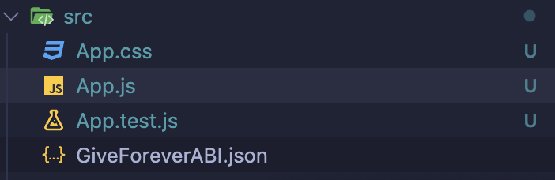
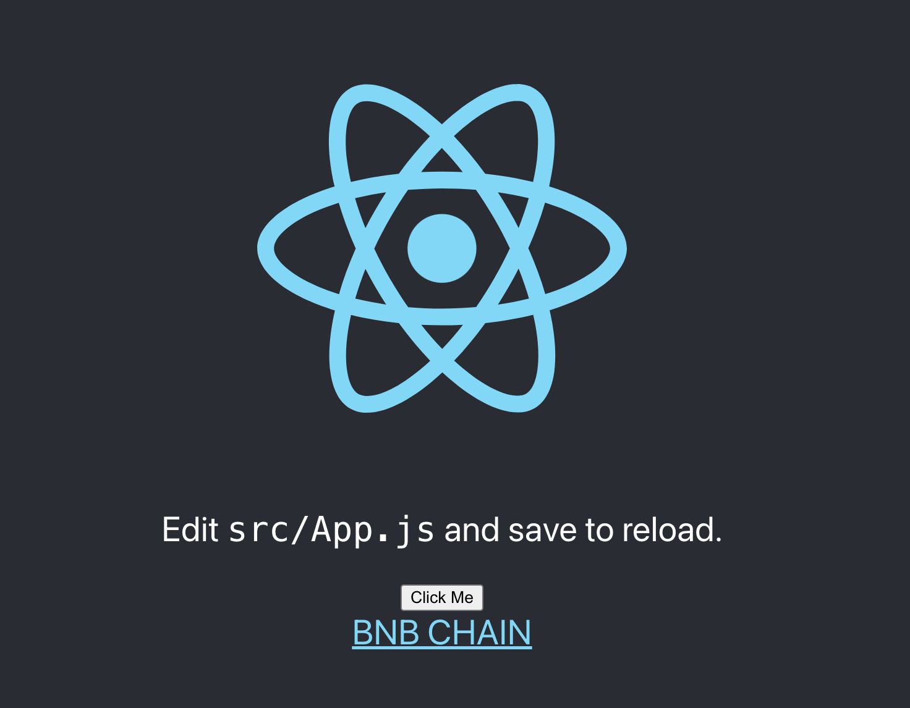
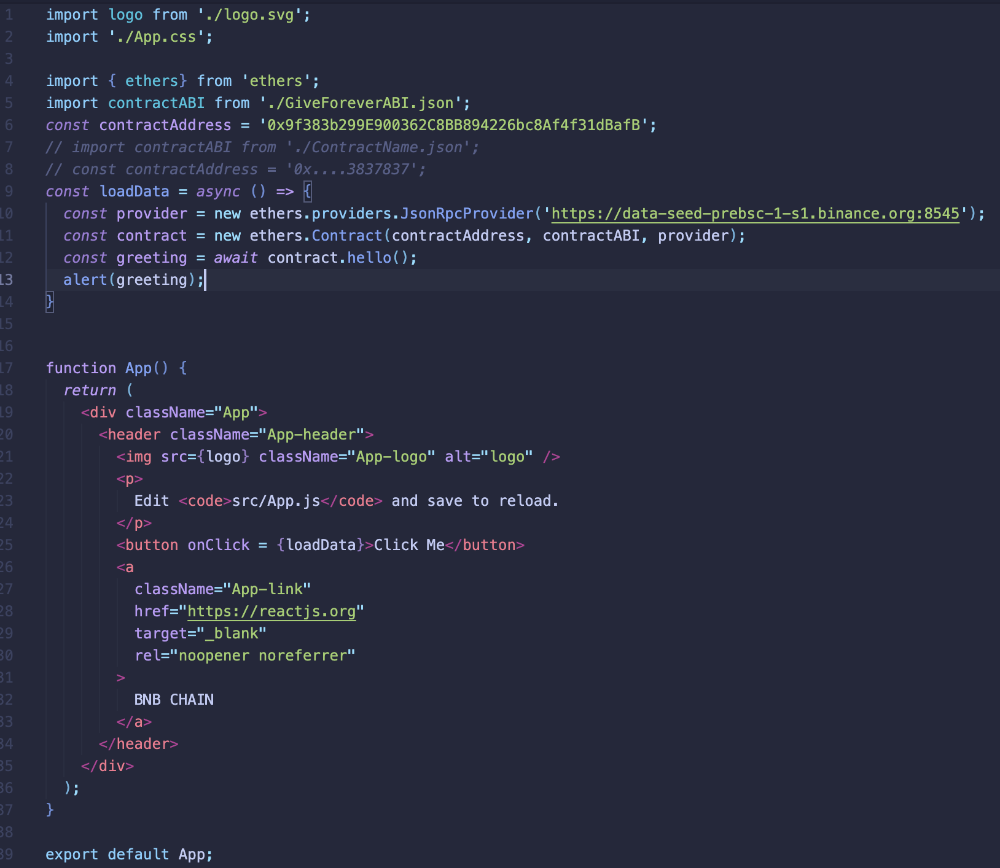
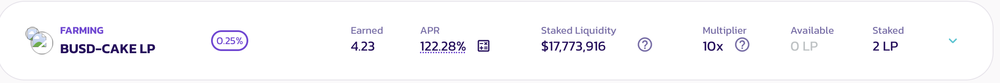

# BNB React-Dapp step-by-step Tutorial
- [**1. Start Tutorial**](start-tutorial)
- [**2. BNB React dApp Challenge**](#bnb--react--dapp--challenege)
    - [**3. Testing Smart Contracts :100:**](#testing-smart-contracts-:100:)

--- 

# Start Tutorial
1. [Recieve tBNB from the test-net faucet](https://testnet.bnbchain.org/faucet-smart)

2. Write your smart contract, and deploy using [Remix IDE](https://remix.ethereum.org/)
    * Save your contract's *deployment contract address*.
    * Same for the *ABI code*.

3. Create a folder in your workspace directory. 
    *  Run $`npm install create-react-app bnb-react-dapp-tutorial`
    * Run $`npm install --save ethers`
    * Run $`npm start`
5. Import *ethers* library into `app.js` at the top of your application's script.

```javascript!
import {ethers} from 'ethers';
```

6. Import your ABI from Remix into a json file under you `src` directory and save 
    * (*"ContractNameABI.json"*)



1. Import your Contract's ABI into `App.js` 
```javascript!
import contractABI from './ContractName.json';
```
1. Import the deployed contract's address into `App.js` 
```javascript!
const contractAddress = '0x....3837837';
```

1. We will use a wallet to connect to the RPC BNB Test Network. Then, we'll create a smart contract and use it to receive a greeting message back to our function. Additionally, we'll add a test case for further confirmation

* Import following code into `App.js`
```javascript!
const loadData = async () => { 
  const provider = new ethers.providers.JsonRpcProvider('https://data-seed-prebsc-1-s1.binance.org:8545');
  const contract = new ethers.Contract(contractAddress, contractABI, provider);
  const greeting = await contract.hello(); // name of function in solidity contract
  alert(greeting);
}
```
### Open [Local Host](http://localhost:3000/) to see the End Result


### Time to Fix bugs
10. You should be able to run the dApp, but you may have already encountered some issues.
* Make sure you have Yarn installed using : 
    * `yarn install`
* If the ethers library is not working, it's most likely because the version of the ethers library you are attempting to use is out of date, to fix this, try this: 
    * Run $`yarn remove ethers`
    * Run $`yarn add ethers@5.6.9` -- *or another version*
> This is a temporary solution to complete the tutorial. However, it's important to note that you can choose different ethers dependencies depending on your specific build. Keep in mind that installing necessary dependencies carries some risks. To determine which version of the ethers library you should install, check the node package manager and yarn.

#### `App.js` Full Example Code



--- 
---
---


# BNB React dApp Challenge
**The objective of this tutorial is to create an application using React or any other framework of your choice using the provided contract ABI and deployed contract addresses.**

## The BNB 'Give Forever' Challenge  :gift_heart: 
**Your challenge is to design an application that performs the following operations:**

1. Swap tBNB testnet tokens for WrappedBNB (WBNB).
2. Swap BNB for CAKE2 tokens using the PancakeSwap routing contract.
3. Enable CAKE2-BUSD token pairing, stake both tokens, and harvest Cake2 token.
4. Allow the contract to automatically harvest Cake2 tokens and swap them for tBNB in a unique and interesting way.
5. The contract should automatically send tBNB to the [BNB CHAIN Charity Wallet.](https://www.binance.charity/projects/1/Binance-Charity-Wallet)
> **BNB Charity Wallet Address** : 0x8B99F3660622e21f2910ECCA7fBe51d654a1517D

**Summary**: Staked CAKE2-BUSD tokens will be converted to CAKE2, which will then be swapped for BNB and sent to charity.

**Your application should be able to execute all of these tasks smoothly and efficiently.**


### Good luck Hackers!
* Be Sure to **Fork** :fork_and_knife:  and leave a **Star** :star: 
* Create a **pull-request** & submit your app to show off your hacking skills !


---
--- 
--- 

# Testing Smart Contracts :100: 
In this tutorial we recommend using pancake purely as an example scenario. You are welcome to use any set of contracts you'd like. 
* [PancakeSwap DEX Dashboard](https://pancakeswap.finance/?chain=bscTestnet)
* [BSC SCAN Test-Net Explorer](https://testnet.bscscan.com/)
* [Remix IDE](https://remix.ethereum.org)


### TEST-NET 'ENABLE' TOKEN CONTRACTS (OPTIONAL)
###### **[Enable BUSD](https://testnet.bscscan.com/token/0xab1a4d4f1d656d2450692d237fdd6c7f9146e814)** 
*contract* : 0xaB1a4d4f1D656d2450692D237fdD6C7f9146e814


###### **[Enable PANCAKESWAP CAKE](https://testnet.bscscan.com/token/0xfa60d973f7642b748046464e165a65b7323b0dee)**
*contract* : 0xFa60D973F7642B748046464e165A65B7323b0DEE

###### **[Enable CAKE2](https://testnet.bscscan.com/address/0x8d008b313c1d6c7fe2982f62d32da7507cf43551)**
*contract* : 0x8d008B313C1d6C7fE2982F62d32Da7507cF43551

###### **[Enable CAKE2 and BUSD Contract for deposit into farm](https://testnet.bscscan.com/address/0x427bf5b37357632377ecbec9de3626c71a5396c1)**
*contract* : 0x427bf5b37357632377ecbec9de3626c71a5396c1

---

### 3 TEST-NET SWAPS
1. **Swap BNB to CAKE2**
    * Swap Contract: [0x9a489505a00cE272eAa5e07Dba6491314CaE3796](https://testnet.bscscan.com/tx/0x959f0a4178c4037dde0cdbda2edbe5c41d4659e15c7e71151ce1ee0ec06545b9)
2. **Wrap BNB to WBNB**
    * Wrap BNB Contract: [0xae13d989daC2f0dEbFf460aC112a837C89BAa7cd](https://testnet.bscscan.com/tx/0x2ad2af759d6f009856f9c12c1ffb8fe967f6b07cef6d709aaa14af425deaa135)
3. **Swap WBNB to BUSD**
    * Enable: [0x9a489505a00ce272eaa5e07dba6491314cae3796](https://testnet.bscscan.com/tx/0xd933aed9f84883e1d72d97614957c19f63cc1158d9bc9fcc86ad0a1acd29b1b9)
Swap: [0x9a489505a00cE272eAa5e07Dba6491314CaE3796](https://testnet.bscscan.com/tx/0xa627b6c5bbbfe28661c161597e5a6cf0c12cba80daaf045b03adaa13fdf7e48b)
---
### TEST-NET POSITION

4. **['ADD' CAKE2-BUSD with LP Contract (2 tx's)](https://testnet.bscscan.com/tx/0xfeec8dbcda87a950278429289c0eae4ab583246e18b1d3ef3e284ce05bf0412d)**
*' Add ' contract* : 0x427bf5b37357632377ecbec9de3626c71a5396c1

5. **['Stake' CAKE2-BUSD with v3 Router Contract (1 tx)](https://testnet.bscscan.com/tx/0x228aa5c998370dea1defec41acb2d931a19cd4913ee4b11225a6a808a42c37f6)**
*' Stake ' contract* : 0x427bF5b37357632377eCbEC9de3626C71A5396c1

6. **[Harvest CAKE2 from CAKE2-BUSD stake ^ (1 tx)](https://testnet.bscscan.com/tx/0x67258679012073d275ddee96b90c9c5e10297413da6414486d6d0884da684c86)**
*' Harvest ' contract* : 0x4c650fb471fe4e0f476fd3437c3411b1122c4e3b

7. **Swapping CAKE2 to BNB PancakeSwap Contracts + txHash's**
    * Enable : [0x9a489505a00ce272eaa5e07dba6491314cae3796](https://testnet.bscscan.com/tx/0x1607ee1e50a1a7d6bb1fd199cbb5cb2d8627318c0b7c1022f4f555e556645d3b)
    * Swap : [0x9a489505a00cE272eAa5e07Dba6491314CaE3796](https://testnet.bscscan.com/tx/0xc61b8cfb6a40d973722db4626b51e9f1e1c2304f445b69830ba3105813dbeca3)

8. **GOAL** :  **[Send BNB Charity Contract Wallet Address](https://bscscan.com/address/0x8b99f3660622e21f2910ecca7fbe51d654a1517d)** 
*Charity Wallet Address* : 0x8B99F3660622e21f2910ECCA7fBe51d654a1517D
    * [ BNB to Charity example tx-Hash](https://testnet.bscscan.com/tx/0xdf76a6ad5759ef4395e512a1f4c892bd9601de50b635a1c0ec2eb8ac1178a9be)



---